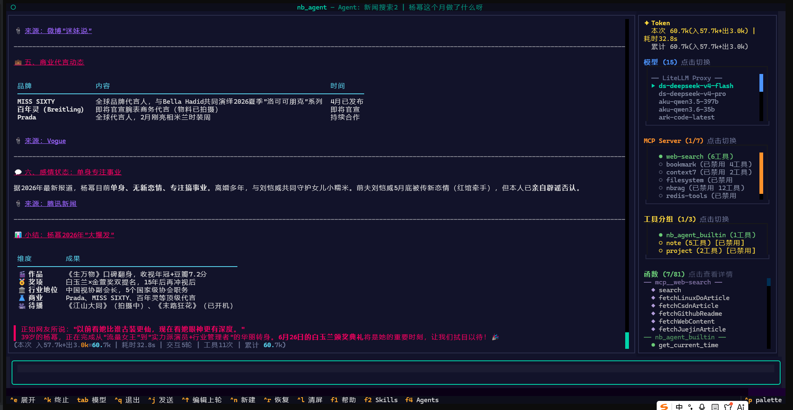
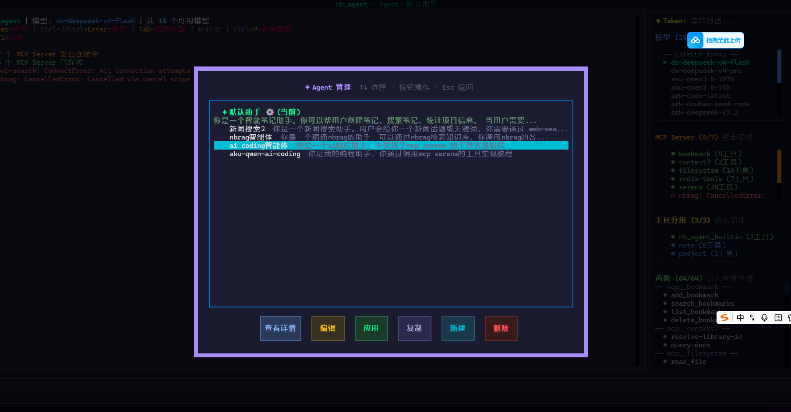
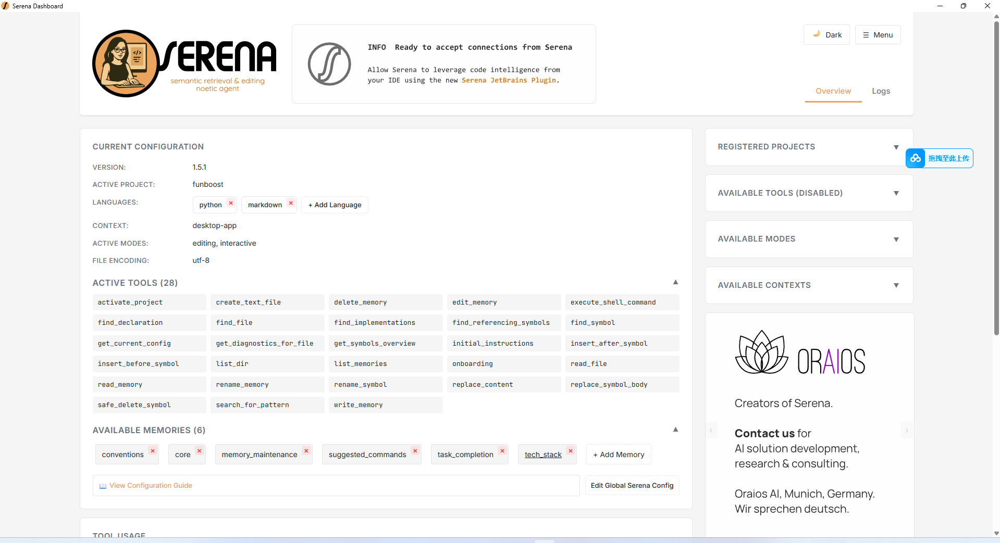
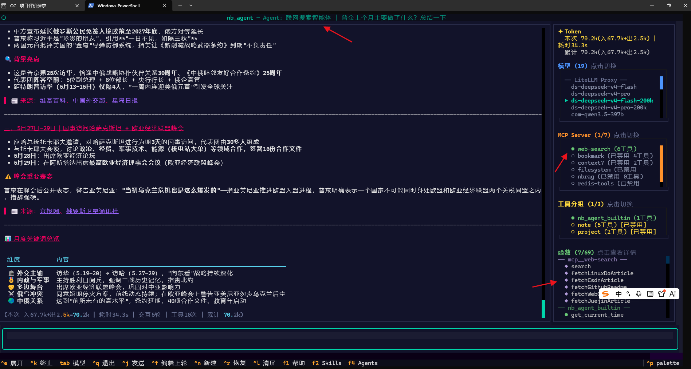

# nb_agent_bfzs 

基于 [nb_agent](https://github.com/ydf0509/nb_agent) 框架的演示项目，展示如何用极少代码构建功能完整的 AI Agent + 终端 TUI。

此项目只是服务于演示nb_agent框架如何使用。
## 快速开始

```bash
pip install nb_agent
cd nb_agent_bfzs
python main.py
```

## 核心代码

```python
# main.py — 完整入口代码
import tools                          # 导入即注册自定义工具
from approval_rules import ALL_RULES
from nb_agent import load_config, AgentApp

config = load_config()
app = AgentApp(config)

for rule in ALL_RULES:                # 注册自定义审批规则
    app.agent.approval_engine.add_rule(rule)

app.run()
```

## 截图例子
使用nb-agent创建一个娱乐八卦新闻智能体，在智能体超级爱你回话提问如下:杨幂这个月做了什么呀？截图如下


创建智能体的界面截图:


nb-agent 是个框架，自带tui，用户希望nb-agent 做什么都可以，可以用于ai coding编程，也可以用于联网娱乐八卦，也可以用于实现用户自定义的功能，nb-agent 不是限定只做claudecode opencdeo这样的ai编程终端。

## 项目结构

```
nb_agent_bfzs/
├── main.py                    # 入口（< 10 行核心代码）
├── config.jsonc                # 模型 + MCP + 审批配置
├── approval_rules.py           # 自定义审批规则
├── nb_log_config.py            # TUI 必需的 nb_log 配置,(自动生成的，不需要用户创建)
│
├── tools/                      # 自定义工具（@tool 装饰器，导入即注册）
│   ├── note_tools.py           #   笔记 CRUD（5 个工具，group="note"）
│   └── project_tools.py        #   项目统计（2 个工具，group="project"）
│
├── mcp_servers/                # 自研 MCP Server（FastMCP 实现）
│   ├── bookmark_server.py      #   书签管理（4 个工具）
│   └── redis_tools_server.py   #   Redis 操作（7 个工具）
│
├── .nb_agent/skills/           # Agent Skills（agentskills.io 规范）
│   ├── daily-report/           #   日报生成
│   ├── meeting-notes/          #   会议纪要
│   ├── git-changelog/          #   Git 变更日志（含辅助脚本）
│   ├── code-review/            #   代码审查
│   ├── refactor/               #   代码重构
│   └── explain-code/           #   代码解释
│
└── notes_data/                 # 笔记存储（运行时创建）
```

## nb_agent_bfzs 项目文件结构注意：

1. nb_agent_bfzs 只是演示 nb_agent框架的一个项目，是为了演示使用 nb-agent框架如何扩展 提示词 skill  tool mcp，不是最终的服务某个特定功能的产品，是个演示demo大杂烩。

2. skills 文件夹下是随意写的假的skill演示例子，不是本项目最终agent产品所需的，主要是为了演示skill的编写规则，遵循 agentskill.io 规范。

3. mcp_servers 文件夹下的mcp，是随便写的mcp，不是本项目最终agent产品所需的，，只是为了演示用户如何自定义自己的mcp，而不是只会依靠配置第三方mcp。

4. tools 文件夹下的工具函数，是随便写的工具函数，不是本项目最终agent产品所需的，只是为了演示用户如何在nb_agent框架中自定义tool函数，自动暴露给ai的请求协议的function字段

5. 这个项目不是为了实现记笔记，只是把记笔记的工具函数演示了下，其他功能都只是为了演示nb_agent框架的功能。

## 用户如何让 nb-agent 作为ai coding 来使用

可以在tui界面，点击agents按钮或者按f4，可以配置一个专属的 ai coding 智能体(但是如果你只搞编程，不精确搞10几个作用场景用途，那也可以不用专门配专门的编程agent)，在这个智能体要绑定 serena 这个mcp。

serena mcp的每个函数已经暴露了 入参和作用给ai，如果要让ai更精通serena，你还可以专门写一个skill，或者写在pomote提示词也行。

nb-agent 能快速化身ai coding工具，是因为serena mcp 提供了精确的 索引 读 写 执行 操作，不需要用户再亲自实现了。


### 注意：

如果要实现编程，只需要介入 serena 这一个mcp就可以了，不要再接各种乱七八糟的mcp。 serena专门为编程而生，具备精确的 索引 读 写 执行 操作，在编程场景吊打通用的 fielsystem mcp读写。
nb-agent化身编程终端，只需要接入serena 这一个mcp就可以了，不要再另外接入其他乱七八糟的file system 和 codegraph 这些mcp。
有的人老是以为编程非要再接 fielsystem mcp ，才能读写项目的代码文件，这是完全错误的想法。

接入太多mcp会浪费tokens和加大ai决策难度，建议只接入必要的mcp。

## nb-agent创建的 联网搜索智能体
让大模型联网搜索总结，“普京上个月做了什么？”


！！注意：大模型本身不能联网，如果你想联网需要配置mcp或者你自己写爬虫tool函数。推荐免费的 open-web-search  这个mcp,可以免费用十几个搜索引擎。


## 演示的 nb_agent 能力

### 1. 自定义工具（@tool 装饰器）

用 Pydantic 定义参数，docstring 作为工具描述，`group` 用于分组管理：

```python
from nb_agent.tools import tool
from pydantic import BaseModel, Field

class CreateNoteParams(BaseModel):
    title: str = Field(description="笔记标题")
    content: str = Field(description="Markdown 内容")
    tags: str = Field(default="", description="逗号分隔的标签")

@tool(group="note")
def create_note(params: CreateNoteParams) -> str:
    """创建一条 Markdown 笔记，保存到 notes_data 目录"""
    # ... 生成文件名，写入 frontmatter + 内容
    return f"笔记已创建: {filename}"
```

本项目注册了 7 个工具：

| 工具名 | 功能 |
|--------|------|
| `note__create_note` | 创建笔记 |
| `note__search_notes` | 按关键词/标签搜索 |
| `note__list_notes` | 列出最近笔记 |
| `note__read_note` | 读取完整笔记 |
| `note__delete_note` | 删除笔记（需审批） |
| `project__project_stats` | 统计文件数、代码行数、类型分布 |
| `project__find_files` | glob 模式搜索文件 |

### 2. MCP Server（FastMCP）

自研两个 MCP Server，通过 `config.jsonc` 配置为 stdio 方式启动：

**书签管理**（`bookmark_server.py`）：
- `add_bookmark` / `search_bookmarks` / `list_bookmarks` / `delete_bookmark`

**Redis 工具**（`redis_tools_server.py`）：
- `redis_execute` — 万能命令执行（禁止 FLUSHDB/SHUTDOWN 等危险命令）
- `redis_info` — 服务器信息
- `redis_keys` — SCAN 搜索 key（含类型/TTL/内存）
- `redis_smart_get` — 自动识别类型读取
- `redis_smart_set` — 智能写入（支持 TTL）
- `redis_db_stats` — 数据库统计
- `redis_slowlog` — 慢查询日志

还配置了两个第三方 MCP：
- **web-search**（SSE）— 多引擎搜索 + 文章抓取
- **filesystem**（npx）— AI 可读写项目目录

### 3. 审批引擎（ApprovalEngine）

双层审批机制：

**配置层**（`config.jsonc`）：
```jsonc
{
  "approval": {
    "dangerous_tools": ["note__delete_note", "mcp__redis-tools__redis_smart_set"],
    "auto_approve": false
  }
}
```

**代码层**（`approval_rules.py`）— 细粒度规则：

```python
REDIS_WRITE_COMMANDS = {"SET", "DEL", "HSET", "LPUSH", "RPUSH", "SADD", ...}

def rule_redis_write(tool_name: str, tool_kwargs: dict) -> bool:
    """Redis 写命令弹窗确认，只读命令（GET/INFO）直接放行"""
    if tool_name != "mcp__redis-tools__redis_execute":
        return False
    cmd = tool_kwargs.get("command", "").strip().split()
    return cmd[0].upper() in REDIS_WRITE_COMMANDS if cmd else False
```

效果：`GET key` 直接放行，`SET key value` 弹窗确认。

### 4. Skills（Markdown 指导手册）

6 个 Skill 覆盖常见开发场景。AI 在需要时自动调用 `view_skill` 加载完整指南：

| Skill | 触发场景 |
|-------|----------|
| daily-report | 写日报、工作总结 |
| meeting-notes | 会议记录、会议纪要 |
| git-changelog | 生成 changelog、查看提交历史 |
| code-review | 代码审查、review PR |
| refactor | 重构、优化代码结构 |
| explain-code | 解释代码功能、理解调用链 |

!!! 说明，这个项目知识演示项目，演示使用nb_agent框架，通过本地 tool函数 mcp skills 实现功能。
这几个skills并不是用于完整的编码，你想要 nb_agent 化身百年城opencode claudecode， 只需要配置好serenae 这个mcp server 就好了，config.jsonc 里面演示了如何配置mcp

### rag知识库
本项目的rag知识库是一个基于nbrag mcp server 的知识库，nbrag是和本项目同一个作者本人。


## TUI 快捷键

| 快捷键 | 功能 |
|--------|------|
| Ctrl+J / Ctrl+Enter | 发送消息 |
| Enter | 输入框内换行 |
| Tab | 切换模型 |
| Ctrl+N | 新建会话 |
| Ctrl+R | 恢复历史会话 |
| Ctrl+K | 终止 AI 回答 |
| Ctrl+P | 命令面板 |
| F1 | 帮助 |
| F2 | Skills 列表 |
| F4 | Agent 管理 |
| Ctrl+Q | 退出 |

## nb_log 配置

TUI 模式下需要在 `nb_log_config.py` 中设置以下 3 项，否则 TUI 会黑屏：

```python
PRINT_WRTIE_FILE_NAME = None   # 禁止 nb_log 劫持 sys.stdout
SYS_STD_FILE_NAME = None       # 禁止 nb_log 劫持 sys.stdout
AUTO_PATCH_PRINT = False       # 禁止 monkey patch print
```

## 配置说明

编辑 `config.jsonc`，主要配置项：

- **provider** — LLM 提供商（支持任何 OpenAI 兼容 API，配置 base_url + api_key + models）
- **agent** — system prompt、默认模型、流式开关
- **mcp** — MCP Server 配置（command + args 或 type + url）
- **approval** — 危险工具名单 + 是否自动审批

API Key 支持 `{env:DEEPSEEK_API_KEY}` 语法从环境变量读取。

## License

MIT
